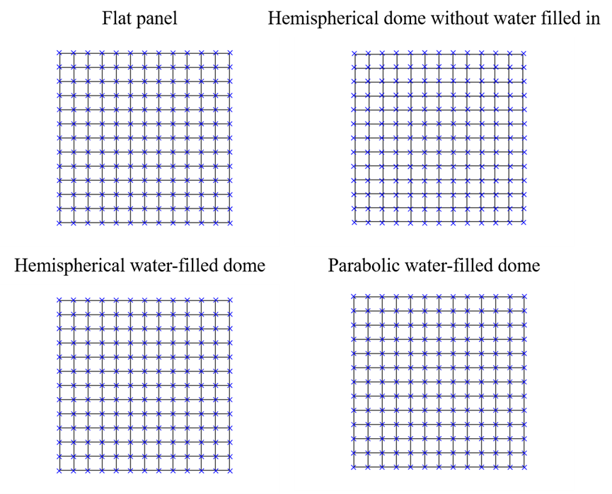
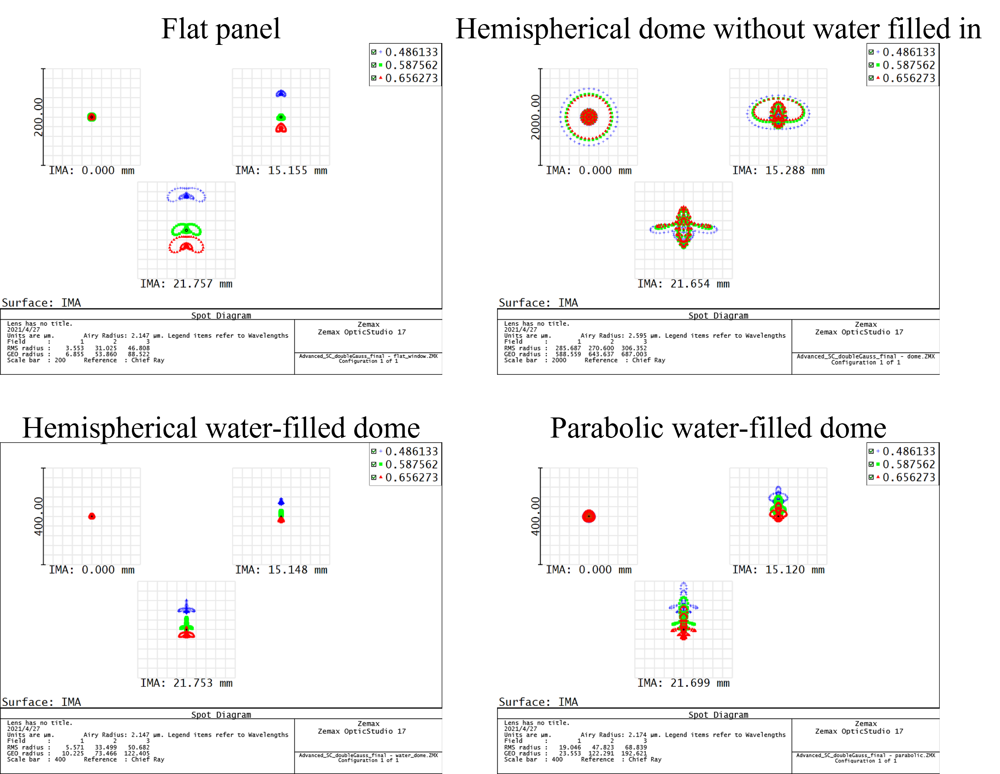
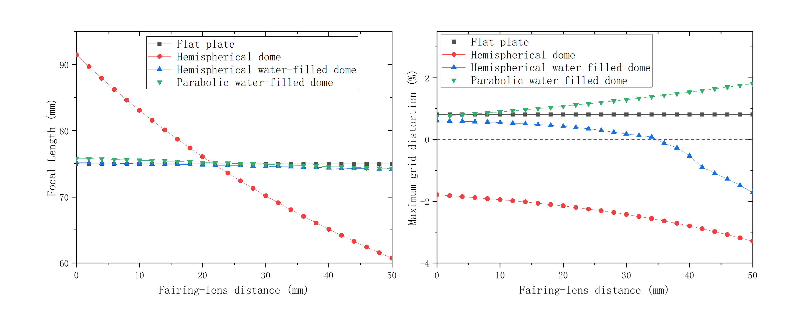
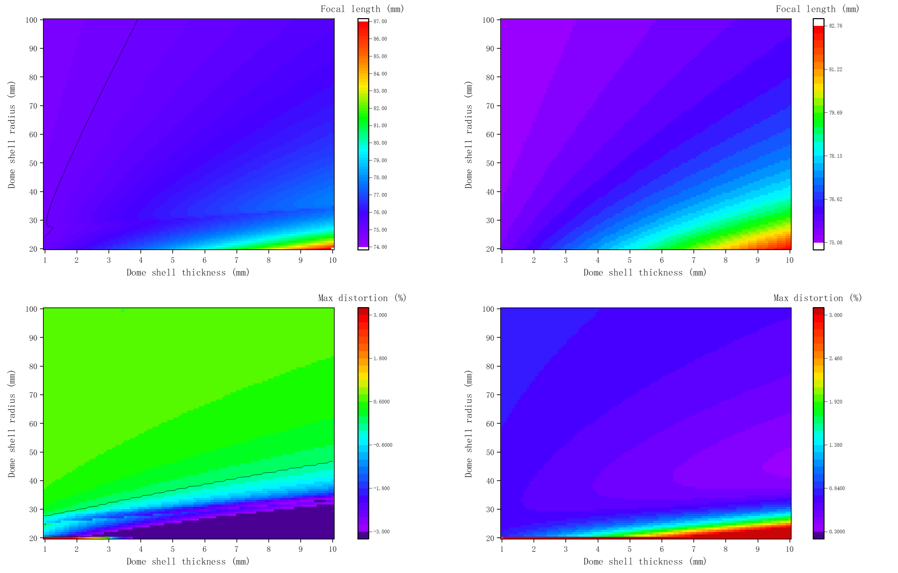

This is an ongoing project. This page is just for showing the preliminary results and will be updated in the future.

We proposed a novel underwater low-resistance optical fairing for AUV. The shape of optical fairing is streamlined so that it can reduce the water resistance. Besides, since the optical fairing is filled with water, the refractive index of the inside and outside of the optical fairing shell is the same. Thus, the refraction of incident light by optical fairing is limited. We conducted a theoretical analysis of the influence on the incident light of spherical optical fairing. Then a numerical simulation is performed using ZEMAX to analyze the aberration caused by the optical fairing. Finally, we performed comparison experiments of the AUV forward-looking camera in air without the optical fairing and the AUV forward-looking camera underwater with the optical fairing.

<h8 style="text-align: justify;">

<figure>
 
  <figcaption>
      <h10>Fig. 1. Baseline lens structure used for fairing design.</h10>
  </figcaption>
</figure>

Fig. 1(a) shows the baseline lens structure (Double gaussian lens) used for fairing design. The simulated image, spot diagram and distortion diagram are shown in Fig. 1(b), (c) and (d), respectively.

<h8 style="text-align: justify;">

<figure>
 
  <figcaption>
      <h10>Fig. 2. Four setups used for design and comparision.</h10>
  </figcaption>
</figure>

Fig. 2 shows four fairing structures with the baseline lens, used for fairing design and comparision. They are flat panel, hemispherical dome without water filled in, hemispherical water-filled dome, and parabolic water-filled dome.

<h8 style="text-align: justify;">

<figure>
 
  <figcaption>
      <h10>Fig. 3. Simulated image of four fairing setups.</h10>
  </figcaption>
</figure>

<h8 style="text-align: justify;">

<figure>
 
  <figcaption>
      <h10>Fig. 4. Distortion diagrams of four fairing setups.</h10>
  </figcaption>
</figure>

<h8 style="text-align: justify;">

<figure>
 
  <figcaption>
      <h10>Fig. 5. RMS spot diagrams of four fairing setups.</h10>
  </figcaption>
</figure>

<h8 style="text-align: justify;">

<figure>
 
  <figcaption>
      <h10>Fig. 6. Left: focal length vs. fairing-lens distance of four fairing setups. Right: Max grid distortion (%) vs. fairing-lens distance of four fairing setups.</h10>
  </figcaption>
</figure>

<h8 style="text-align: justify;">

<figure>
 
  <figcaption>
      <h10>Fig. 7. Focal length and max grid distortion (%) vs. dome shell thickness and dome shell radius, respectively. Left: hemispherical water-filled dome. Right: parabolic water-filled dome.</h10>
  </figcaption>
</figure>

<h8 style="text-align: justify;">

<figure>
 
  <figcaption>
      <h10>Fig. 8. Experiment images of cameras behind hemispherical dome without water filled in (upper), hemispherical water-filled dome (lower).</h10>
  </figcaption>
</figure>