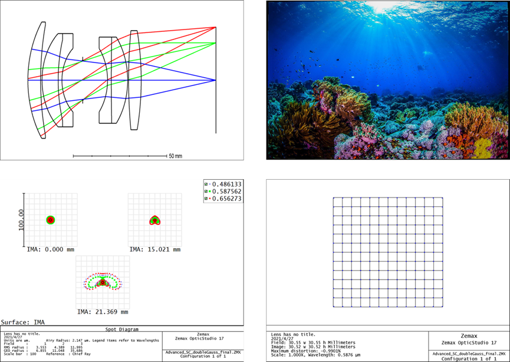
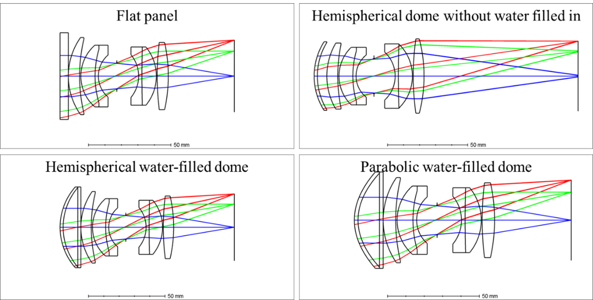
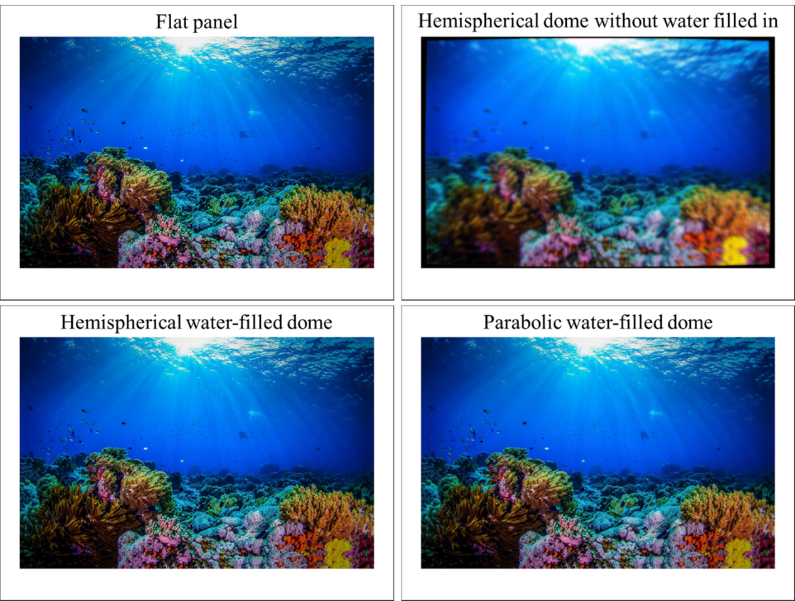

This is an ongoing project. This page is just for showing the preliminary results and will be updated in the future.

Color images are of great significance to underwater detailed survey and exploration. The underwater image is usually blurreed, with low signal-to-noise ratio and severe noise. The traditional underwater image enhancement algorithm can hardly improve image quality to a very high level. Although the image enhancement algorithm based on depth learning has achieved good results in the images in the air, it is difficult to work for underwater images for lack of underwater image datasets. Focusing on this problem, we developed novel underwater simulation method. As shown in Fig. 1, a dataset of simulated underwater images at different attenuation lengths (ALs) were built.Preliminary experiments are carried out and neural networks are designed for image enhancement, which has achieved good results on the open dataset, but still needs to be further improved (Fig. 2, 3).

<h8 style="text-align: justify;">

<figure>
 
  <figcaption>
      <h10>Fig. 1. Simulated underwater images at different ALs.</h10>
  </figcaption>
</figure>

<h8 style="text-align: justify;">

<figure>
 
  <figcaption>
      <h10>Fig. 2. Image enhancement results on benchmark dataset (with references baseline).</h10>
  </figcaption>
</figure>

<h8 style="text-align: justify;">

<figure>
 
  <figcaption>
      <h10>Fig. 3. Image enhancement results on benchmark dataset (without references baseline).</h10>
  </figcaption>
</figure>
