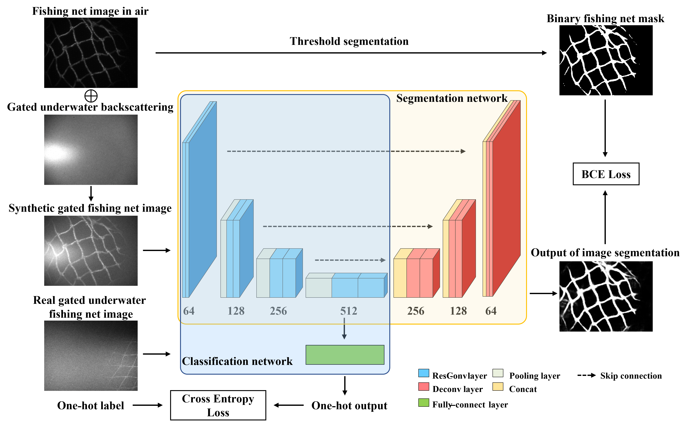
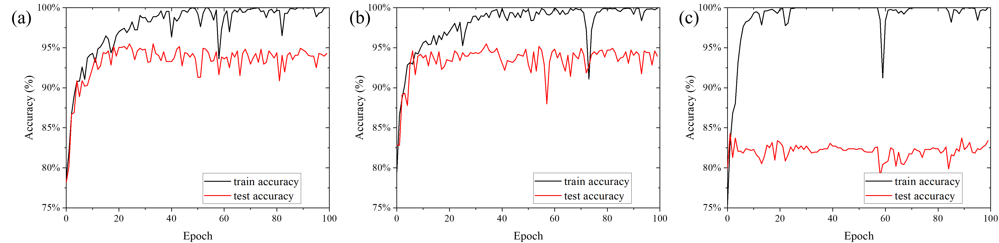
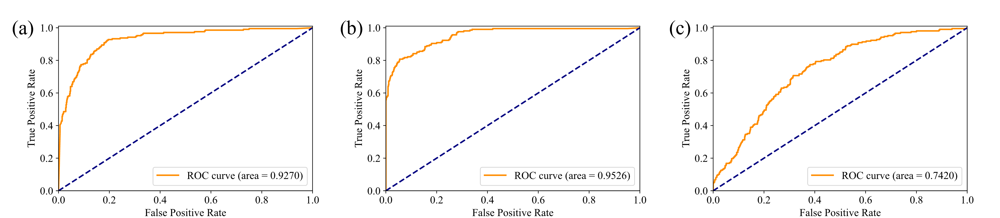

A mask-guided deep learning fishing net detection and recognition method based on underwater range gated laser imaging is proposed. Range gated laser imaging technology is used to obtain high quality underwater fishing net images with less water backscattering effect and background noise. A dual-phase training strategy including mask-guided feature extraction phase and classification finetune phase is proposed to avoid overfitting of training the neural network. The mask-guided feature extraction phase takes advantages of image segmentation training from synthetic dataset to get a better feature extraction performance. The highest overall accuracy of the proposed method reaches 95.49% in fishing net classification task under finetuned weight configuration. The proposed method can effectively help unmanned underwater vehicles and robots from entangling by fishing nets as well as retrieving derelict fishing nets for marine environment protection.

<h8 style="text-align: justify;">

<figure>
 
  <figcaption>
      <h10>Fig. 1. Training process of mask-guided deep learning fishing net detection and recognition algorithm.</h10>
  </figcaption>
</figure>

Fishing net detection and recognition can be regarded as a binary classification task. In this paper, the classification algorithm is implemented by deep learning method. The framework of the proposed algorithm, called mask-guided deep learning fishing net detection and recognition algorithm, is shown in Fig. 1. The training of neural network is divided into two phases of the mask-guided feature extraction phase and classification finetune phase. Firstly, the image segmentation network is used in the mask-guided feature extraction phase. The input of image segmentation network is synthetic gated fishing net image with binary fishing net mask as the label of image segmentation. The synthetic gated fishing net image is generated by weighted sum of in-air fishing net image and gated underwater backscattering image. The binary fishing net mask is generated by threshold segmentation of fishing net image captured in air without noise and backscatter. The output of image segmentation network is the extracted fishing net twine. Binary cross-entropy (BCE) loss is used for the training of mask-guided feature extraction phase.

The image segmentation network used in mask-guided feature extraction phase can be considered as an encoder-decoder network. By the training of image segmentation task, the encoder part of the image segmentation network plays a role of extracting features from the image. The decoder part is used to combine features and extract the part of the image that satisfies the corresponding features as the output of image segmentation. The jump connection part is used to integrate information from different scales of the image. By inheriting the trained weights, the encoder part of image segmentation network can be used as a feature extractor for the classification network. This is why the first phase is called mask-guided feature extraction phase. This phase is designed to avoid overfitting and enhance the robustness and generalization performance of the proposed algorithm. In-air fishing net images are used to train the network, because compared to the difficulty of obtaining underwater fishing net images of different materials, twine thicknesses, distances, poses, etc., it is easy to collect a large number of different fishing net images in air. Besides, the binary fishing net mask can be obtained by a simple threshold segmentation method, since the in-air images contain few disturbances. The weighted addition operation on in-air fishnet images and gated underwater backscatter noise is used to simulate gated underwater fishing net images with different distances, water quality, and illumination conditions. Thus, a large and well-established dataset is built to train the network without overfitting.

In the classification finetune phase, the backbone of the classification network is the encoder part of the image segmentation network above. The classification network can share the same initial weights from the encoder part. In order to complete the classification task, a fully connected layer is added to the encoder network after the bottleneck, and followed by a one-hot output after sigmoid activation function. The input of the classification network is underwater fishing net images captured by a RGI system, and the output is the class of the image indicating whether it contains a fishing net or not. In fact, in this paper, the classification network is a shallow ResNet structure. The cross entropy loss is used in the training process of the classification finetune phase. The encoder weights can be fixed or given a small learning rate in the classification finetune phase.

When the algorithm is deployed to the fishing net detection and recognition equipment, only the classification network is needed. The image segmentation network used in mask-guided feature extraction phase is only used for training. However, the mask-guided feature extraction phase is necessary for the avoidance of overfitting and enhancing the robustness.

<h8 style="text-align: justify;">

<figure>
 
  <figcaption>
      <h10>Fig. 2. Part of the images and masks from the dataset, (a) fishing net images in air, (b) corresponding binary masks of (a), (c) gated fishing net images as positive samples, (d) gated non-fishing-net images as negative samples.</h10>
  </figcaption>
</figure>

In the mask-guided feature extraction phase, 3140 in-air fishing net images with masks are used for training. 3635 images with one-hot labels are used for training in classification finetune phase, of which 2787 images are negative samples including water backscatter, background, or other non-fishing-net objects such as aquatic plants, 848 images are positive samples of gated underwater fishing net images. The 2787 images negative samples are also used as noise term of synthetic gated fishing net images for the training process of mask-guided feature extraction phase. 909 images with labels are used as test dataset, including 208 positive samples and 701 negative samples. Part of the images and masks are shown in Fig. 2. 20 epochs are trained in mask-guided feature extraction phase while 100 epochs are trained in the classification finetune phase.

<h8 style="text-align: justify;">

<figure>
 
  <figcaption>
      <h10>Fig. 3. Training and test accuracy in different epochs of three configurations, (a) the FixWC, (b) the FinWC, (c) the RIWC.</h10>
  </figcaption>
</figure>

For comparison, three training configurations are used as follows: 
(1) The fixed weight configuration (FixWC) is fixing the inherited weights of the encoder part from mask-guided feature extraction phase, and training the fully-connected layer with a learning rate of 0.001;
(2) The finetuned weight configuration (FinWC) is finetuning the inherited weights of the encoder part from mask-guided feature extraction phase with a learning rate of 0.0001, training the fully-connected layer with a learning rate of 0.001; 
(3) The random initialized weight configuration (RIWC) is randomly initializing the weights of classification network without inheriting from mask-guided feature extraction phase, with a learning rate of 0.0001 for encoder part and 0.001 for fully-connected layer.

The results of image classification accuracy on training and test dataset during the training process of the three configurations above are shown in Fig. 3. It is shown that for each configuration, the training accuracy grows and reaches approximately 100% during the training process. However, the test accuracy reaches approximately 95% and then fluctuates around 92% in FixWC (Fig. 3(a)) or FinWC (Fig. 3(b)). As a comparison, for RIWC which simply trains the network in classification finetune phase from scratch (Fig. 3(c)), the test accuracy can only reach 84% though the training accuracy reaches 100%. The maximum ACCs of three configurations are 95.16%, 95.49%, and 84.27% respectively. The highest ACC reaches 95.49% in the FinWC. The training process shows that the mask-guided feature extraction phase in the proposed algorithm can avoid overfitting by higher-level image processing tasks such as image segmentation, with synthetic dataset. For fishing net detection and recognition task, the overfitting problem is crucial since actually captured images usually contain more complex scenes and under complex conditions with noise.

<h8 style="text-align: justify;">

<figure>
 
  <figcaption>
      <h10>Fig. 4. ROC curves of the algorithms. (a), (b) and (c) shows the ROC curve of the FixWC, the FinWC and the RIWC, respectively.</h10>
  </figcaption>
</figure>

Fig. 4 shows the ROC curve of the algorithms under the three training configurations above. The AUC is 0.9270 for the FixWC, 0.9526 for the FinWC, while 0.7420 for the RIWC. The FinWC has the best comprehensive performance. The ROC curves and AUC shows that the mask-guided feature extraction phase in the proposed algorithm can enhance the performance by increasing the TPR while reducing the FPR. In the classification finetune phase, finetuning inherited weights of encoder part with a small learning rate can obtain a better classification performance than leaving them fixed after the mask-guided feature extraction phase.

<h8 style="text-align: justify;">

<figure>
 
  <figcaption>
      <h10>Fig. 5. Fishing net images and their Grad-CAMs of different training configurations.</h10>
  </figcaption>
</figure>

To further study the reason why the mask-guided feature extraction phase works, gradient-weighted class activation mapping (Grad-CAM) technique [1] is used to evaluate the activation maps of input images. The Grad-CAM image can highlight the important regions in the image used for feature extraction and classification. In Fig. 6, the highlighting regions of the Grad-CAMs show network activation levels of the three training configurations, where the redder regions represent higher activation level while the bluer regions represent lower activation level. The Grad-CAMs of Fig. 5 illustrate that different from the RIWC, the FixWC and the FinWC can focus more on fishing net knots, twines and mesh holes, rather than water scattering or other interferences.

The network attention is not the only reason why the mask-guided feature extraction phase works. For images with severe defocus, backscattering, and motion blur, the network responds more robustly to fishnet features and less distracted by other objects. Training for image segmentation task also makes the network more efficient in feature combination.

____________________________________________
References:  
1. 	R. R. Selvaraju, M. Cogswell, A. Das, R. Vedantam, D. Parikh, and D. Batra, "Grad-CAM: Visual Explanations from Deep Networks via Gradient-Based Localization," in 2017 IEEE International Conference on Computer Vision (ICCV) (2017), pp. 618–626.