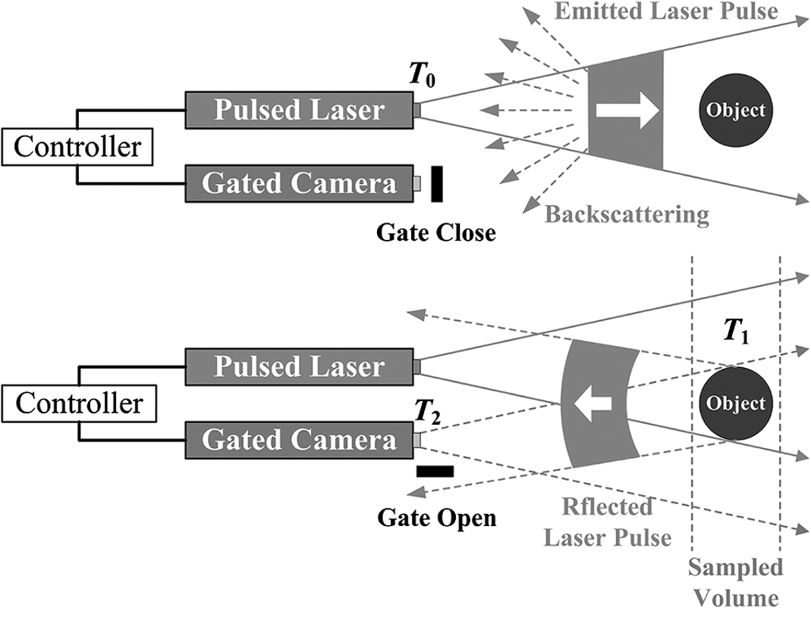
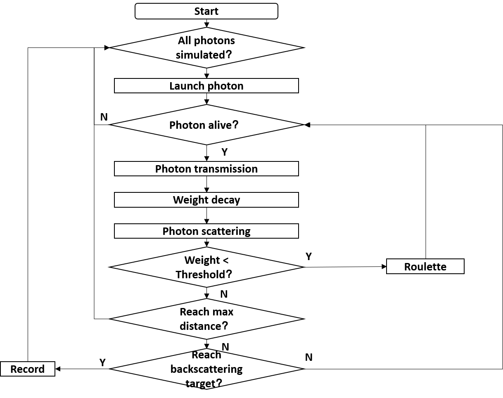
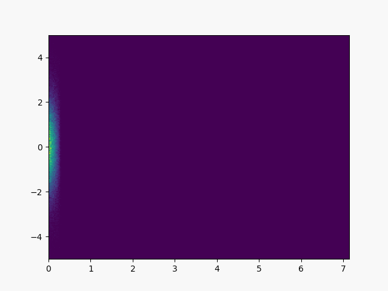
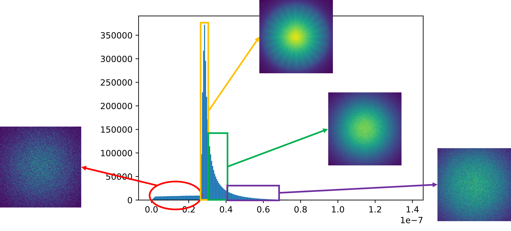
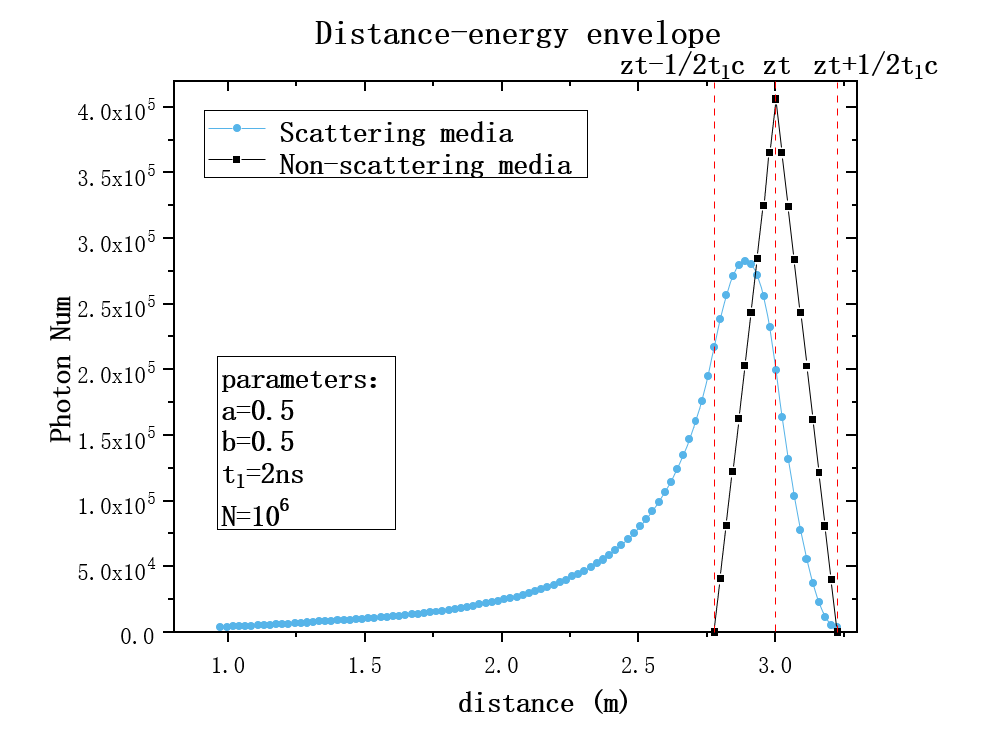

<h8 style="text-align: justify;">

<figure>
 
  <figcaption>
      <h10>Fig. 1. Range-gated imaging</h10>
  </figcaption>
</figure>

Underwater optical imaging technology has become the standard configuration of new types of underwater vehicles, having been widely used in resource survey, underwater archeology, subsea pipeline inspection, marine ecology research, fishery resource assessment, Autonomous Underwater Vehicle(AUV) obstacle avoidance, and so on. Compared with conventional underwater optical imaging technology, the imaging distance of range-gated imaging [Fig. 1] is increased by 2~3 times. Gated imaging is an imaging technique using light source with adjustable pulse and a detector with adjustable gate. Since the gated detector only receives the light that enters the detector within a certain period of time, gated imaging can suppress environmental noise and a target image with a high signal-to-noise ratio can be obtained. Due to the convolution effect of the pulsed laser and the gated gate, the echo signal intensity of the target at different distances forms a triangular or trapezoidal envelope, which can reflect the distance information of the target, so the range-gated imaging can obtain the three-dimensional information of the target.

However, the backscattering effect of seawater still exists in the imaging range, which leads to the decrease in image signal-to-noise ratio(SNR) and contrast. It has become a research hotspot for underwater range-gated imaging that how to further reduce or filter the backscattering noise of seawater to improve the image contrast and the imaging distance. Based on the underwater transmission characteristics of the blue-green laser, the Monte Carlo method was used to simulate the underwater range-gated imaging. The relationship between the backscattering noise distribution and the inherent optic property(IOP) of water and gating parameters was simulated, providing a new way of reducing backscattering noise. The simulation workflow is shown in Fig. 2. 

<figure>
 
  <figcaption>
      <h10>Fig. 2. Workflow of MC simulation of imaging process</h10>
  </figcaption>
</figure>

In order to explore the rules of gated imaging in scattering media, we are going to establish a Monte-Carlo Active Imaging Simulation Platform ([MAISP](https://github.com/Msirte/MAISP)). Now MAISP has the preliminary functions, but still needs to be further improved, and combined with the experimental data. We simulated the process of light transmission in a scattering medium, shown in Fig. 3. 

<figure>
 
  <figcaption>
      <h10>Fig. 3. Light transmission in a scattering medium</h10>
  </figcaption>
</figure>

We designed some preliminary simulation experiments and got some useful results. Fig. 4 describes the time distribution of the echo signal of gated imaging in the scattering medium. It can be seen that the target echo signal does not only appear at one time, but exhibits a broadening effect. According to the degree of photon being scattered, the photon received by the detector is divided into ballistic photon, snake-like photon and backscattering photon. Among them, ballistic photon obeys the linear propagation law, and it also carries the most target information; snake-like photon carries partial target information, but due to the scattering effect of the medium, it is different from ballistic photon in terms of time and space distribution. Different from the characteristics of the straight line propagation law, it will reduce the contrast of the image and produce a blur effect; the backscattering photon does not carry target information, and acts as a pure noise component in the target image. In terms of time distribution, the photons before the target echo pulse are pure backscattering photons, the target echo pulse is dominated by signal photons, and within a short period of time after the target echo pulse, the snake-like photon is the main component. With the further increase of time, the photons in the echo include more backscattering photons and snake-like photons with severe scattering.

<figure>
 
  <figcaption>
      <h10>Fig. 4. Spatiotemporal characteristics of scattered light</h10>
  </figcaption>
</figure>

The simulation also obtained new conclusions in underwater distance-gated 3D imaging. For example, the triangular or trapezoidal distance energy envelope in a non-scattering environment is no longer applicable, and the distance energy envelope has new characteristics of energy depression, forward broadening and smoothing [Fig. 5]. These new features help to improve the 3D imaging algorithm, improve the range resolution and range accuracy of 3D imaging.

<figure>
 
  <figcaption>
      <h10>Fig. 5. Distance-energy envelope in scattering media</h10>
  </figcaption>
</figure>

This is still an onging project and further phenomenon need to be studied. All the work is carried out under the supervision of Prof. Xinwei Wang, at Institute of Semiconductors, Chinese Academy of Sciences.

____________________________________________
References:  
[1]. A.A. Leino, A. Pulkkinen and T. Tarvainen, ValoMC: a Monte Carlo software and MATLAB toolbox for simulating light transport in biological tissue, OSA Continuum 2, 957-972 (2019).  

</h8>