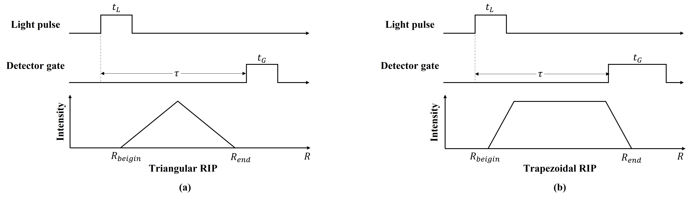
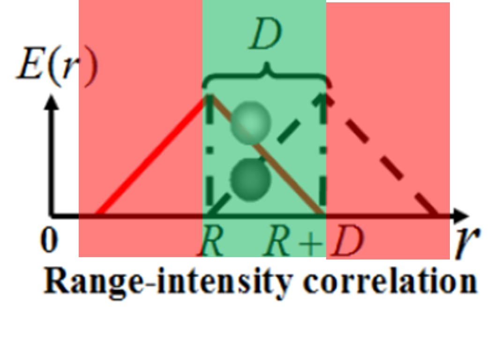
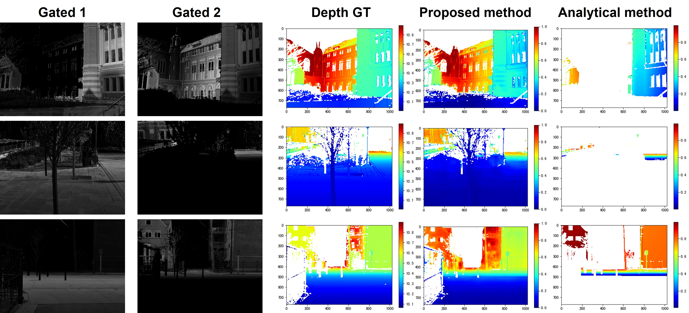

<h8 style="text-align: justify;">

<figure>
 
  <figcaption>
      <h10>Fig. 1. Range-Intensity Profile.</h10>
  </figcaption>
</figure>

In range-gated imaging, the pulsed light source and the gated camera is synchronized with a delay time. Therefore, the intensity of target in received image is related to the distance of the target from the detector. The distance-intensity correlation is described by Range-Intensity Profile (RIP). The RIP curve can be triangular or trapzoidal, according to differnet light pulse time and detector gate time, as shown in Fig.1. The intensity of target is also related to the reflection rate. So it's impossible to recover the distance information from one single gated image. However, using two (or more) gated images with different RIPs, the distance of target can be recovered by solving the equations using RIPs.

<h8 style="text-align: justify;">

<figure>
 
  <figcaption>
      <h10>Fig. 2. Overlap area and non-overlap area of two RIPs.</h10>
  </figcaption>
</figure>

This method works when the target locates in the RIP overlap area (shown with green color in Fig.2). In the incomplete area of RIP (shown with red color in Fig.2), the depth cannot be recovered analytically. However, due to the continuity of depth in the scene and the semantic information, part of the depth information can stilled be recovered by learning-based method, as shown in Fig.3.

<h8 style="text-align: justify;">

<figure>
 
  <figcaption>
      <h10>Fig. 3. Recovered depth map from incomplete RIPs.</h10>
  </figcaption>
</figure>

This is still an onging project and further phenomenon need to be studied. All the work is carried out under the supervision of Prof. Xinwei Wang, at Institute of Semiconductors, Chinese Academy of Sciences.
