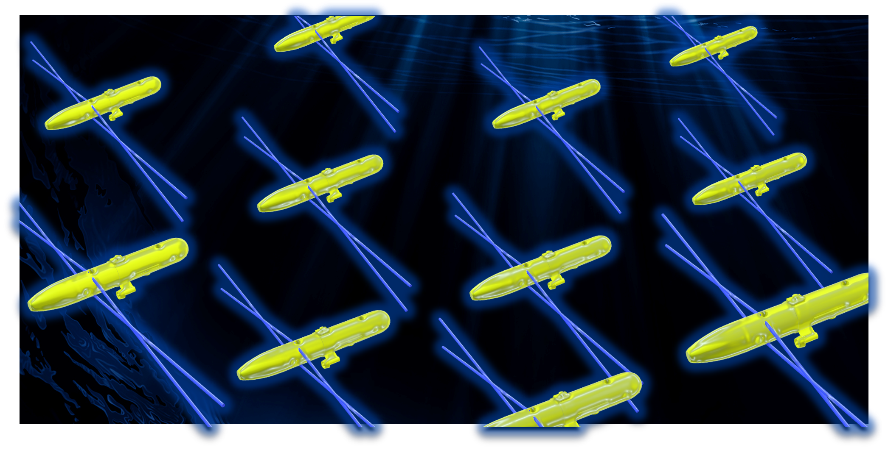
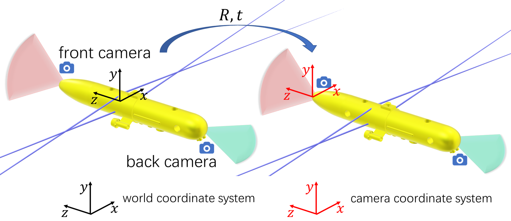
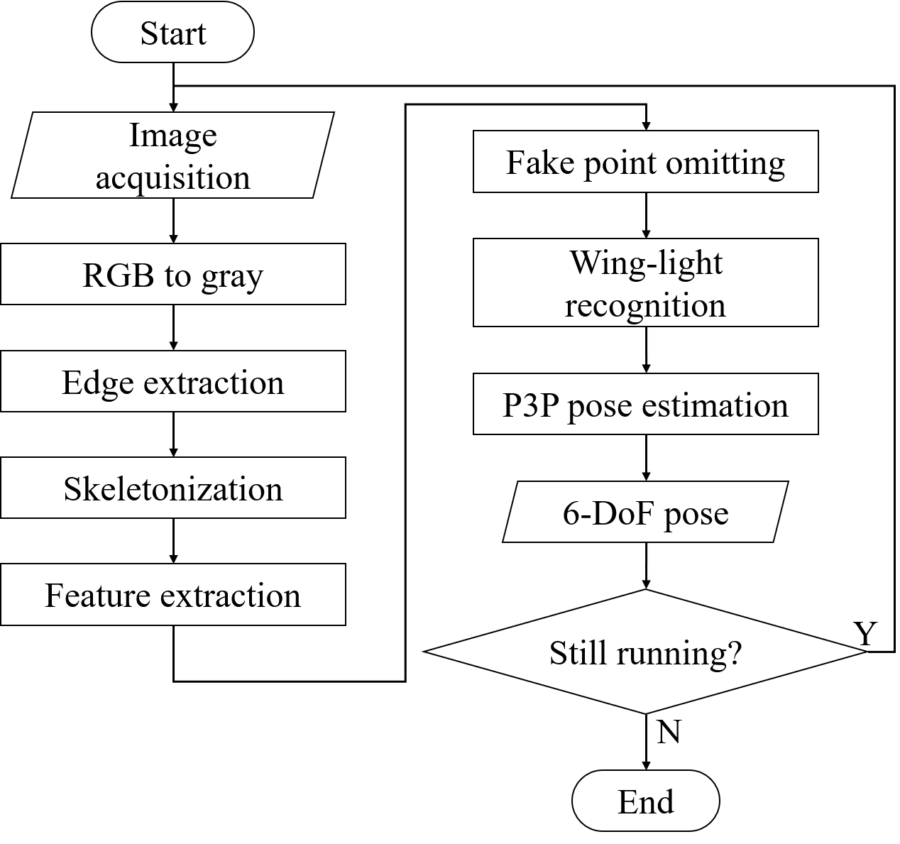
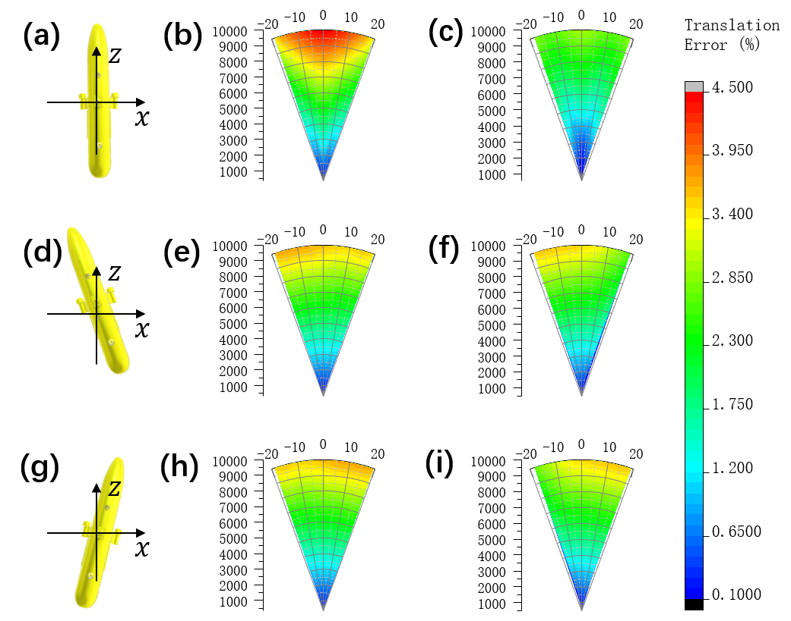

<h8 style="text-align: justify;">

<figure>
 
  <figcaption>
      <h10>Fig. 1. Smart optical vision guiding system.</h10>
  </figcaption>
</figure>

We proposed a smart optical vision guiding method for AUV formation. Unlike the traditional optical guiding methods which use LED arrays, our method uses the vector-light guiding system consisting of four laser diodes mounted on AUV housing. Thanks to the scattering effect of water and the collimation of laser beam, laser diodes can go off bright and slim ray beams. The intersections of laser ray lines form wing-lights, providing markers for pose estimation algorithm. Wing-light can be easily extended beyond the mechanical dimensions of AUV, which improves the precision of pose calculation. We performed simulations and experiments, which show smart optical vision guiding method having high precision and practical for AUV formation, especially for small AUVs.

<figure>
 
  <figcaption>
      <h10>Fig. 2. AUVs equipped with vector-light guiding system, front and back camera.</h10>
  </figcaption>
</figure>

In the smart optical vision based guiding method, when performing AUV formation task, each AUV is equipped with a vector-light guiding system, as well as the front camera and back camera, shown in Fig. 2. The image of vector-light guiding system equipped on AUV-A is captured by the front or back camera on the other AUV-B. Let the world coordinate system locate on AUV-A while camera coordinate system locate on camera of AUV-B. Since the dimensions of vector-light guiding system is known, the relative rotation matrix R and translation vector t from world to camera coordinate systems can be calculated by AUV-B. Thus, the relative 6-DoF pose of AUV-A can be recovered.

<figure>
 
  <figcaption>
      <h10>Fig. 3. The workflow of pose acquisition algorithm for smart optical vision based guiding method.</h10>
  </figcaption>
</figure>

The workflow of pose acquisition algorithm is shown in Fig.3. The image proceeding process is shown in Video. 1. After that, the one-to-one correspondence between the four wing-light points detected in the image and the four wing-light points in the world coordinate system is made. Finally, the relative 6-DoF pose of AUV is solved by P3P pose estimation algorithm.

<figure>
<video src="optical-guiding.mp4" width="800px" height="600px" controls="controls"></video>
  <figcaption>
      <h10>Video. 1. Image proceeding.</h10>
  </figcaption>
</figure>

We performed simulations on the precision of pose estimation under two situations: (1) AUV using vector-light guiding system, (2) AUV using LED lights directly mounted on the outer wall as markers. The simulation results [Fig. 4] show that at different relative yaw angles, pose estimation of AUV equipped with vector-light guiding system is more accurate compared to AUV mounted with LED array. 

<figure>
 
  <figcaption>
      <h10>Fig. 4. Simulation results on the precision of pose estimation of AUV equipped with vector-light guiding system and AUV mounted with LED array as markers in different relative pose. (a), (d), (g) AUVs at yaw angle of 0, -10 and 10 degree. (b), (e), (h) positioning error of AUVs mounted LED array at yaw angle of 0, -10 and 10 degree. (c), (f), (i) positioning error of AUVs equipped with vector-light guiding system at yaw angle of 0, -10 and 10 degree.</h10>
  </figcaption>
</figure>

This is still an onging project and further experiments need to be performed. All the work is carried out under the supervision of Prof. Xinwei Wang, at Institute of Semiconductors, Chinese Academy of Sciences.

Related paper:
* Yue Zhang, Shaomeng Wang, Xinwei Wang, Pingshun Lei, Yuqing Yang, Yan Zhou, Smart optical vision guide for AUV formation，Optics Letters. (Under progress)

The code cannot be provided for the reason of confidentiality.
____________________________________________
References:  
1. D. R. Blidberg, in IEEE ICRA (2001), 4, p. 1.
2. M. Carreras, J. D. Hernandez, E. Vidal, N. Palomeras, D. Ribas, and P. Ridao, IEEE J. Oceanic Eng. 43, 344–355 (2018).
3. M. P. Brito, R. S. Lewis, N. Bose, and G. Griffiths, IEEE Trans. Eng. Manage. 66, 98–111 (2019).
4. Martins, Almeida, and Silva, in Oceans 2003. Celebrating the Past ... Teaming Toward the Future (IEEE Cat. No.03CH37492) (IEEE, 2003), pp. 347-352 Vol.1.
5. G. You, Y. Pang, and D. Jiang, J Mar. Sc. Appl. 4, 7–12 (2005).
6. M. F. Fallon, G. Papadopoulos, and J. J. Leonard, in 2010 IEEE International Conference on Robotics and Automation (IEEE, 2010), pp. 4256–4263.
7. J. E. Manley, in 2004 IEEE/OES Autonomous Underwater Vehicles (IEEE Cat. No.04CH37578) (IEEE, 2004), pp. 20–25.
8. P. Baccou, B. Jouvencel, V. Creuze, and C. Rabaud, in MTS/IEEE Oceans 2001. An Ocean Odyssey. Conference Proceedings (IEEE Cat. No.01CH37295) (Marine Technol. Soc, 2001), 3, pp. 1816–1821.
9. Gao Rui and M. Chitre, in OCEANS’10 IEEE SYDNEY (IEEE, 2010), pp. 1–6.
10. K. G. Kebkal and A. I. Mashoshin, Gyroscopy Navig. 8, 80–89 (2017).
11. A. B. Figueiredo, B. M. Ferreira, and A. C. Matos, in OCEANS 2016 - Shanghai (IEEE, 2016), pp. 1–7.
12. K. N. Lwin, N. Mukada, M. Myint, D. Yamada, M. Minami, T. Matsuno, K. Saitou, and W. Godou, Artif Life Robotics 23, 409–419 (2018).
13. Y. Hamamatsu, T. Matsuda, T. Sakamaki, and T. Maki, in OCEANS 2019 - Marseille (IEEE, 2019), pp. 1–5.
14. R. Pérez-Alcocer, L. A. Torres-Méndez, E. Olguín-Díaz, and A. A. Maldonado-Ramírez, Journal of Sensors 2016, 1–16 (2016).
15. J.-Y. Park, B. Jun, P. Lee, and J. Oh, Ocean Engineering 36, 48–61 (2009).
16. Y. Li, Y. Jiang, J. Cao, B. Wang, and Y. Li, Ocean Engineering 110, 163–173 (2015).
17. Xiao-Shan Gao, Xiao-Rong Hou, Jianliang Tang, and Hang-Fei Cheng, IEEE Trans. Pattern Anal. Machine Intell. 25, 930–943 (2003).
18. R. O. Duda and P. E. Hart, Commun. ACM 15, 11–15 (1972).