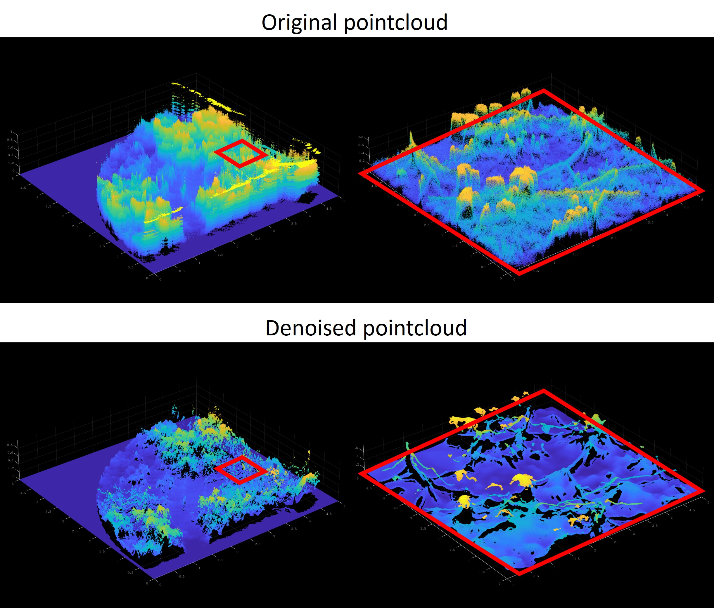

<h8 style="text-align: justify;">

This is an ongoing project. This page is just for showing the preliminary results and will be updated in the future.  
  
Traditional LiDAR point cloud processing methods typically rely on neighborhood-based operations and statistical filtering. However, dense point clouds—especially those captured by image-grade LiDAR—contain richer detail and implicit semantic information. This enables the application of image processing algorithms to point cloud denoising and tail artifact removal by effectively leveraging prior semantic knowledge.

Fig.1 illustrates the denoising performance of a variational PDE method based on total variation (TV) priors applied to dense vegetation point clouds.

<figure>
 
  <figcaption>
      <h10>Fig. 1. TV denoising algorithm for dense pointcloud.</h10>
  </figcaption>
</figure>

</h8>