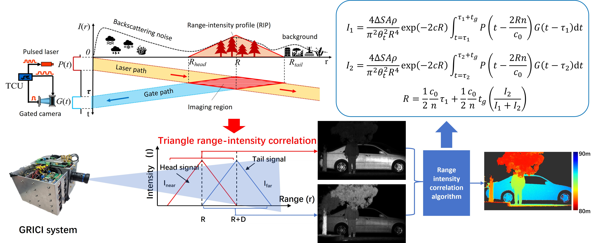
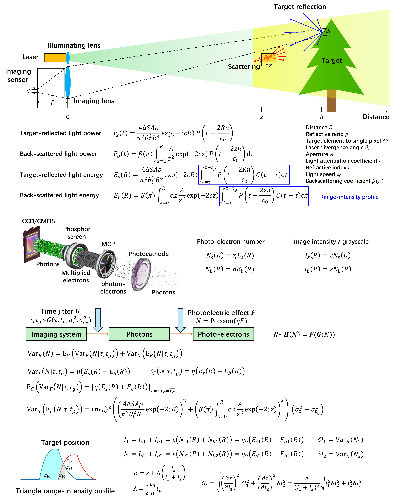

<h8 style="text-align: justify;">

Gated imaging enables selective depth slicing within the target region, where the image intensity within the range slice is correlated by target distance, known as the range-intensity profile (RIP). By acquiring two gated frames with overlapping range regions, 3D reconstruction can be performed within their common range region. This technique is referred to as Gated Range-Intensity-Correlated 3D Imaging (GRICI). The priciple of GRICI is shown in Fig.1.

<figure>
 
  <figcaption>
      <h10>Fig. 1. Priciple of Range-Intensity-Correlated 3D Imaging (GRICI).</h10>
  </figcaption>
</figure>

Despite its potential, the range resolution of GRICI has not been thoroughly investigated. In this project, we propose a comprehensive range resolution model for GRICI using a compound stochastic analysis framework. The model incorporates the full imaging pipeline, including light propagation, target reflection, backscattering, receiving optics, detector response, system time jitter, and 3D reconstruction algorithms. The proposed model has been experimentally validated and provides a systematic and in-depth understanding of the factors influencing range resolution. It offers valuable guidance for the design of GRICI systems and can be extended to other time-of-flight (TOF) based 3D imaging technologies. Some of the analysis is shown in Fig.2.

<figure>
 
  <figcaption>
      <h10>Fig. 2. Range resolution analysis of GRICI.</h10>
  </figcaption>
</figure>

</h8>