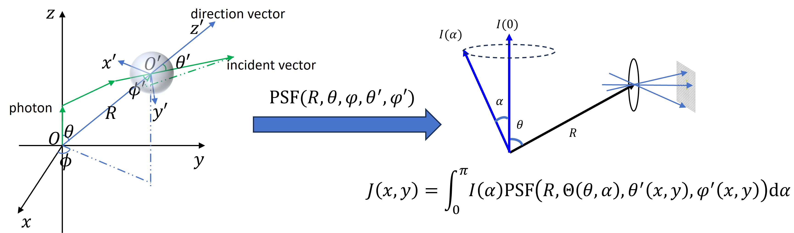
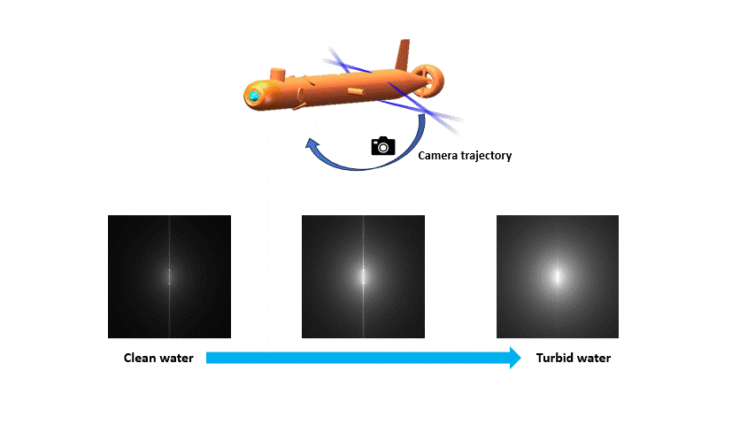

<h8 style="text-align: justify;">
This is an ongoing project. This page is just for showing the preliminary results and will be updated in the future.

Using the Monte Carlo method, we simulate the light intensity distribution of an underwater light source. Based on an approximation of the multiple scattering model, each step in the underwater light propagation process is treated as a random sampling event, and the spatial energy distribution is computed throughout the propagation. The final underwater light source image is obtained by calculating the statistical expectation. The simulation focuses on three key components: the light source, the transmission medium, and the detector.

As shown in Fig. 1, the photon transport characteristics are described by the Point Spread Function (PSF), which represents the probability that a photon emitted along the z+ direction within a specific water environment will arrive at a point in spherical coordinates and at a specific incidental angle.

Leveraging the geometric symmetry relationships, the light intensity distribution image on the detector for a light source  can be computed by the convolution of its angular intensity distribution and the PSF.

Fig. 2 shows underwater images of four laser beams intersecting to form two cross patterns, captured from different angles and under various water conditions.

<figure>
 
  <figcaption>
      <h10>Fig. 1. From PSF to lightsource image.</h10>
  </figcaption>
</figure>

<figure>
 
  <figcaption>
      <h10>Fig. 2. Image enhancement results on benchmark dataset (with references baseline).</h10>
  </figcaption>
</figure>

</h8>