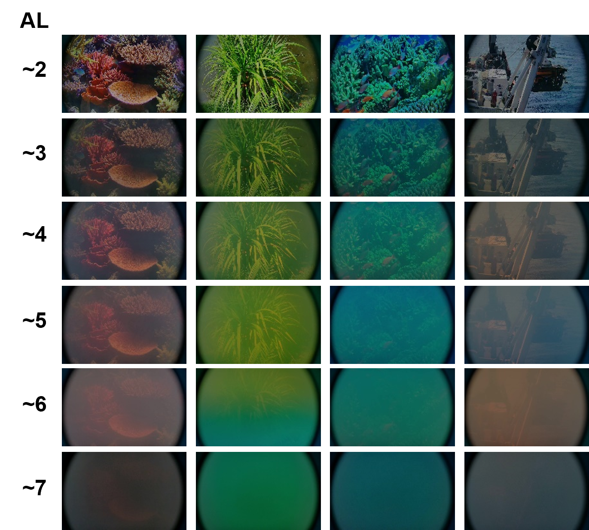

这是一个正在进行的项目。 此页面仅用于展示初步结果，并将在未来进行更新。

彩色图像对于水下详细调查和勘探具有重要意义。 水下图像通常模糊，信噪比低，噪声严重。 传统的水下图像增强算法很难将图像质量提高到一个很高的水平。 虽然基于深度学习的图像增强算法在空气中图像中取得了很好的效果，但由于缺乏水下图像数据集，难以对水下图像取得很好的结果。 针对这一问题，我们开发了新颖的水下图像仿真方法。 如图1所示，建立了不同衰减长度（ALs）的仿真水下图像数据集。进行了初步实验，设计了神经网络，在公开数据集上取得了较好的效果，但仍有待进一步改进（图 2、3）。

<h8 style="text-align: justify;">

<figure>
 
  <figcaption>
      <h10>图 1. 不同衰减长度（ALs）的仿真水下图像数据集.</h10>
  </figcaption>
</figure>

<h8 style="text-align: justify;">

<figure>
 
  <figcaption>
      <h10>图 2. 公开数据集上的图像增强效果(有真值对照).</h10>
  </figcaption>
</figure>

<h8 style="text-align: justify;">

<figure>
 
  <figcaption>
      <h10>图 3. 公开数据集上的图像增强效果(无真值对照).</h10>
  </figcaption>
</figure>
