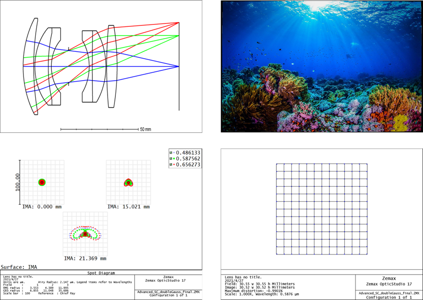
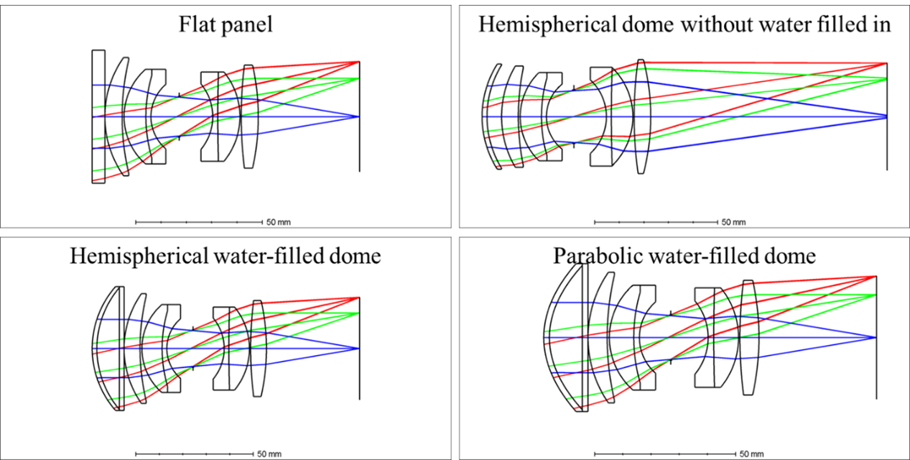
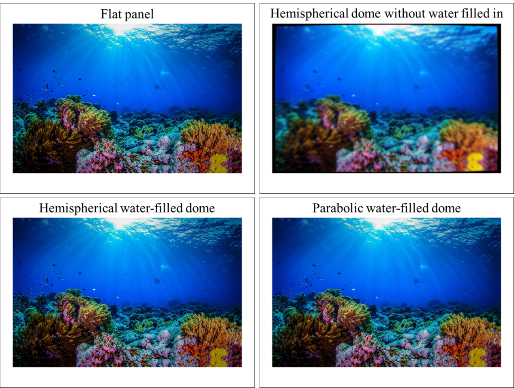
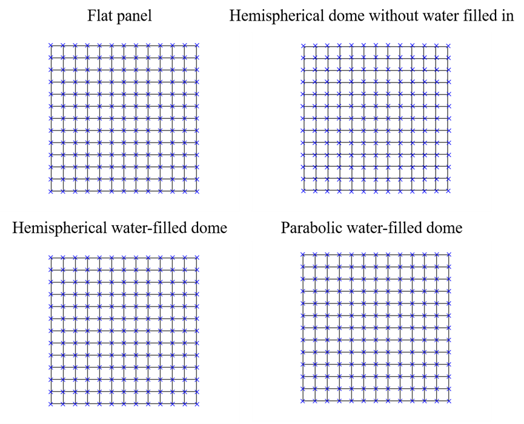
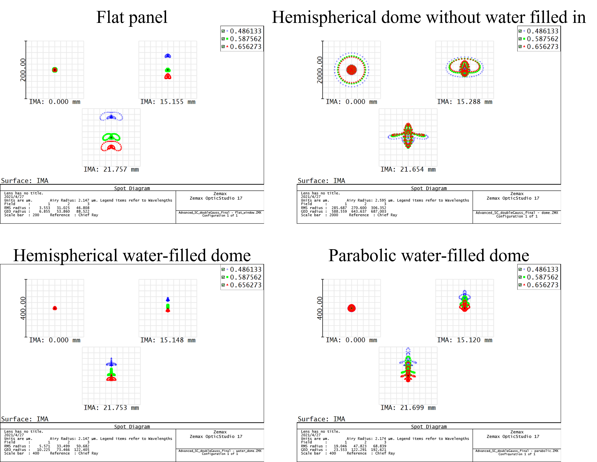
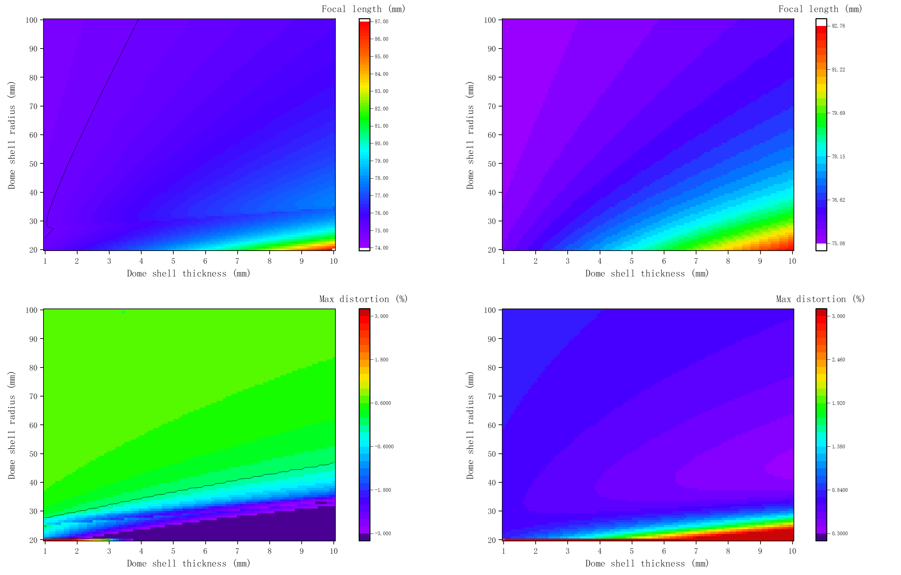

这是一个正在进行的项目。 此页面仅用于展示初步结果，并将在未来进行更新。

我们提出了一种用于 AUV 的新型水下低阻光学整流罩。 光学整流罩的形状采用流线型设计，可降低水阻。 此外，由于光学整流罩内充满了水，因此光学整流罩外壳内外的折射率相同。 因此，光学整流罩对入射光的折射程度很小。 我们对球形光学整流罩对入射光的影响进行了理论分析。 然后使用ZEMAX进行数值模拟分析光学整流罩引起的像差。 最后，我们对不带光学整流罩的AUV前视相机和带光学整流罩的AUV前视相机在水下进行了对比实验。

<h8 style="text-align: justify;">

<figure>
 
  <figcaption>
      <h10>图 1. 用于整流罩设计的初始镜头结构.</h10>
  </figcaption>
</figure>

图 1(a) 显示了用于整流罩设计的初始透镜结构（双高斯透镜）。 模拟图像、弥散斑图和畸变图分别如图1(b)、(c)和(d)所示。

<h8 style="text-align: justify;">

<figure>
 
  <figcaption>
      <h10>图 2. 用于设计和比较的四个整流罩方案.</h10>
  </figcaption>
</figure>

图 2 显示了四个带有初始透镜的整流罩结构，用于整流罩设计和比较。 它们是平板、未充水的半球形整流罩、半球形充水整流罩和抛物线形充水整流罩。

<h8 style="text-align: justify;">

<figure>
 
  <figcaption>
      <h10>图 3. 四个整流罩方案的仿真图象.</h10>
  </figcaption>
</figure>

<h8 style="text-align: justify;">

<figure>
 
  <figcaption>
      <h10>图 4. 四个整流罩方案的畸变图.</h10>
  </figcaption>
</figure>

<h8 style="text-align: justify;">

<figure>
 
  <figcaption>
      <h10>图 5. 四个整流罩方案的弥散斑图.</h10>
  </figcaption>
</figure>

<h8 style="text-align: justify;">

<figure>
 
  <figcaption>
      <h10>图 6. 左图：四个整流罩设置的焦距与整流罩-透镜距离关系图。 右图：最大网格畸变 (%) 与整流罩-透镜距离关系图.</h10>
  </figcaption>
</figure>

<h8 style="text-align: justify;">

<figure>
 
  <figcaption>
      <h10>图 7. 焦距和最大网格畸变 (%) 分别与整流罩外壳厚度和外壳半径的关系。 左图：半球形充水整流罩。 右：抛物线充水整流罩.</h10>
  </figcaption>
</figure>

<h8 style="text-align: justify;">

<figure>
 
  <figcaption>
      <h10>图 8. 未注水半球罩（上）、半球注水罩（下）的相机拍摄场景实验图.</h10>
  </figcaption>
</figure>