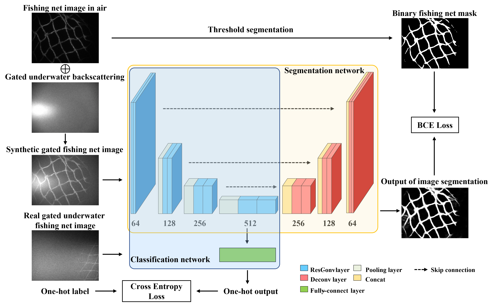
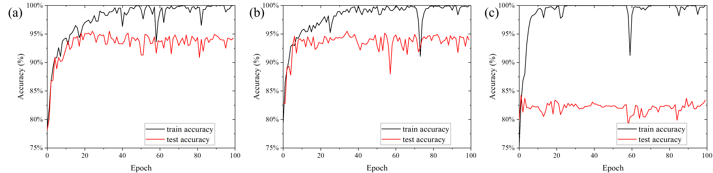
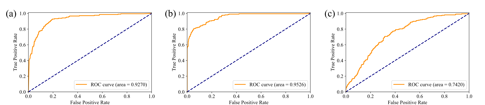

提出了一种基于水下选通激光成像的掩模引导深度学习渔网检测识别方法。 利用距离选通激光成像技术获得水后向散射效应小、背景噪声小的高质量水下渔网图像。 提出了一种包括掩模引导特征提取阶段和分类微调阶段的双阶段训练策略，以避免训练神经网络的过度拟合。 掩模引导特征提取阶段利用合成数据集的图像分割训练来获得更好的特征提取性能。 在微调权重配置下，该方法在渔网分类任务中的最高总体准确率达到 95.49%。 所提出的方法可以有效地帮助无人水下航行器和机器人避免被渔网缠住，以及找回废弃的渔网以保护海洋环境。

<h8 style="text-align: justify;">

<figure>
 
  <figcaption>
      <h10>图 1. 掩模引导深度学习渔网检测识别算法训练过程.</h10>
  </figcaption>
</figure>

渔网检测和识别可以看作是一个二分类任务。 本文采用深度学习方法实现分类算法。 所提出的算法框架称为掩模引导深度学习渔网检测和识别算法，如图1所示。神经网络的训练分为掩模引导特征提取阶段和分类微调阶段两个阶段。 首先，图像分割网络用于掩模引导特征提取阶段。 图像分割网络的输入是以二值渔网掩码作为图像分割标签的合成选通渔网图像。 合成选通渔网图像由空中渔网图像和选通水下后向散射图像加权和生成。 二值渔网掩码是通过对空中捕获的无噪声和后向散射的渔网图像进行阈值分割生成的。 图像分割网络的输出是提取的渔网线。 二元交叉熵（BCE）损失函数用于掩模引导特征提取阶段的训练。

在掩模引导特征提取阶段使用的图像分割网络可以被认为是一个encoder-decoder网络。 通过图像分割任务的训练，图像分割网络的编码器部分起到从图像中提取特征的作用。 解码器部分用于对特征进行组合，提取图像中满足相应特征的部分作为图像分割的输出。 跳跃连接部分用于整合来自图像不同尺度的信息。 通过继承训练的权重，图像分割网络的编码器部分可以用作分类网络的特征提取器。 这就是为什么第一阶段被称为掩模引导特征提取阶段。 该阶段旨在避免过度拟合并增强所提出算法的鲁棒性和泛化性能。 使用空中渔网图像来训练网络，因为相比于获取不同材质、麻线粗细、距离、姿态等的水下渔网图像的难度，收集大量不同的空气中渔网的图像更容易。 此外，二值渔网掩码可以通过简单的阈值分割方法获得，因为空气中图像包含很少的干扰。 对空气中渔网图像和选通水下后向散射噪声进行加权相加运算，模拟不同距离、水质和光照条件下的选通水下渔网图像。 因此，构建了一个大型且完善的数据集来训练网络而不会过度拟合。

在分类微调阶段，分类网络的骨干是上面图像分割网络的编码器部分。 分类网络可以共享来自编码器部分的相同初始权重。 为了完成分类任务，在瓶颈之后的编码器网络中加入了一个全连接层，并在sigmoid激活函数之后进行了one-hot输出。 分类网络的输入是 RGI 系统捕获的水下渔网图像，输出是表示图像是否包含渔网的类别。 事实上，在这篇论文中，分类网络是一个浅层的ResNet结构。 交叉熵损失用于分类微调阶段的训练过程。 编码器的权重可以是固定的，或者在分类微调阶段给定一个小的学习率。

该算法部署到渔网检测识别设备时，只需要分类网络即可。 掩模引导特征提取阶段使用的图像分割网络仅用于训练。 然而，掩模引导的特征提取阶段对于避免过度拟合和增强鲁棒性是必要的。

<h8 style="text-align: justify;">

<figure>
 
  <figcaption>
      <h10>图 2. 来自数据集的部分图像和掩模，(a) 空中的渔网图像，(b) 对应的二进制掩模，(c) 作为正样本的选通渔网图像，(d) 选通非渔网图像作为负样本.</h10>
  </figcaption>
</figure>

在掩模引导特征提取阶段，使用3140张带有mask的空中渔网图像进行训练。 3635张带one-hot标签的图像用于分类微调阶段的训练，其中2787张图像为负样本，包括水后向散射、背景或其他非渔网物体如水生植物，848张图像为选通渔网图像（正样本）。 2787个图像负样本也被用作合成选通渔网图像的噪声项，用于掩模引导特征提取阶段的训练过程。 909张带有标签的图像被用作测试数据集，包括208个正样本和701个负样本。 部分图像和掩模如图 2 所示。在掩模引导特征提取阶段训练了 20 个 epoch，在分类微调阶段训练了 100 个 epoch。

<h8 style="text-align: justify;">

<figure>
 
  <figcaption>
      <h10>图 3. 三种配置在不同时期的训练和测试精度，(a) FixWC，(b) FinWC，(c) RIWC.</h10>
  </figcaption>
</figure>

为了进行比较，采用了三种训练配置，如下所示：
(1)固定权重配置(FixWC)，固定编码器部分从掩模引导特征提取阶段继承的权重，以0.001的学习率训练全连接层；
(2)微调权重配置(FinWC)，以0.0001的学习率对掩模引导特征提取阶段编码器部分的继承权值进行微调，以0.001的学习率训练全连接层；
(3)随机初始化权重配置(RIWC)，随机初始化分类网络的权重，不继承掩模引导特征提取阶段，编码器部分学习率为0.0001，全连接层学习率为0.001。

在上述三种配置的训练过程中，训练和测试数据集的图像分类精度结果如图 3 所示。结果表明，对于每种配置，训练精度在训练过程中都在增长并达到约 100%。 然而，在 FixWC（图 3（a））或 FinWC（图 3（b））中，测试准确率达到约 95%，然后在 92% 左右波动。 作为比较，对于从头开始训练分类微调阶段网络的 RIWC（图 3（c）），尽管训练精度达到 100％，但测试精度只能达到 84％。 三种配置的最大ACC分别为95.16%、95.49%和84.27%。 FinWC 最高 ACC 达到 95.49%。 训练过程表明，所提出算法中的掩模引导特征提取阶段可以避免图像分割等高级图像处理任务与合成数据集的过度拟合。 对于渔网检测和识别任务，过拟合问题至关重要，因为实际捕获的图像通常包含更复杂的场景和复杂的噪声。

<h8 style="text-align: justify;">

<figure>
 
  <figcaption>
      <h10>图 4. 算法的 ROC 曲线。 (a)、(b)和(c)分别显示了FixWC、FinWC和RIWC的ROC曲线.</h10>
  </figcaption>
</figure>

图 4 显示了算法在上述三种训练配置下的 ROC 曲线。 FixWC 的 AUC 为 0.9270，FinWC 为 0.9526，而 RIWC 为 0.7420。 FinWC 的综合性能最好。 ROC曲线和AUC表明，所提出算法中的掩模引导特征提取阶段可以通过增加TPR同时降低FPR来提高性能。 在分类微调阶段，微调具有小学习率的编码器部分的继承权重可以获得比在掩模引导特征提取阶段之后保持固定更好的分类性能。

<h8 style="text-align: justify;">

<figure>
 
  <figcaption>
      <h10>图 5. 不同训练配置的渔网图像及其 Grad-CAM.</h10>
  </figcaption>
</figure>

为了进一步研究掩模引导特征提取阶段起作用的原因，使用梯度加权类激活映射 (Grad-CAM) 技术 [1] 来评估输入图像的激活图。 Grad-CAM 图像可以突出图像中用于特征提取和分类的重要区域。 在图 5 中，Grad-CAM 的突出显示区域显示了三种训练配置的网络激活水平，其中较红的区域表示较高的激活水平，而较蓝的区域表示较低的激活水平。 图 5 的 Grad-CAM 表明，与 RIWC 不同，FixWC 和 FinWC 可以更多地关注渔网结、麻线和网孔，而不是水散射或其他干扰。

网络注意力并不是掩模引导特征提取阶段起作用的唯一原因。 对于具有严重虚焦、后向散射和运动模糊的图像，网络对渔网特征的响应更加鲁棒，并且更少受到其他物体的干扰。 图像分割任务的训练也使网络在特征组合方面更加高效。

____________________________________________
参考资料：  
1. 	R. R. Selvaraju, M. Cogswell, A. Das, R. Vedantam, D. Parikh, and D. Batra, "Grad-CAM: Visual Explanations from Deep Networks via Gradient-Based Localization," in 2017 IEEE International Conference on Computer Vision (ICCV) (2017), pp. 618–626.