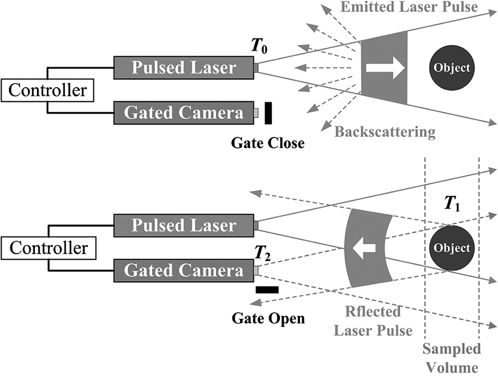
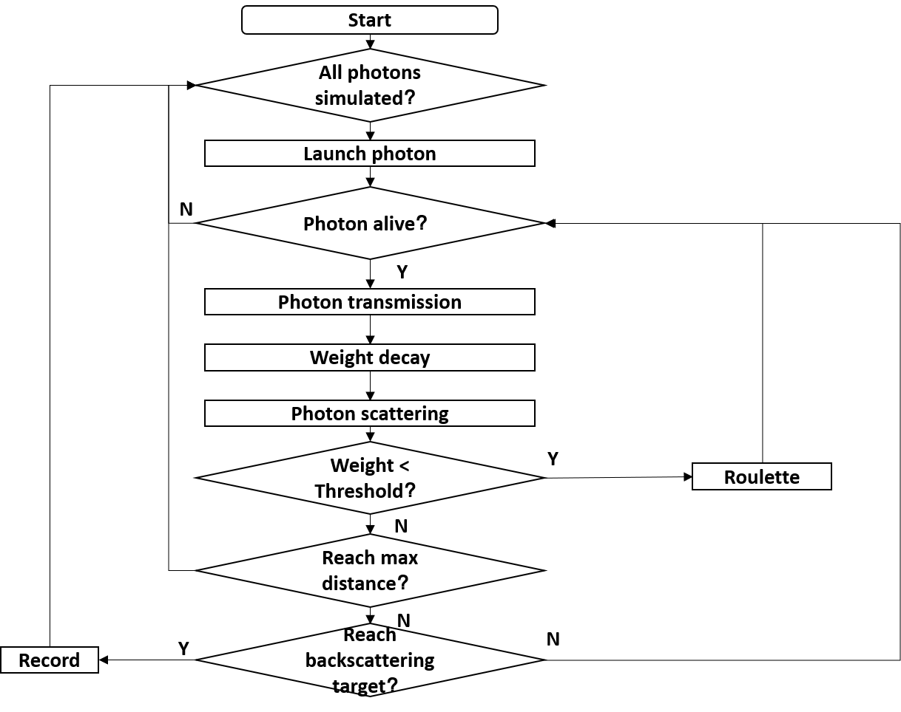
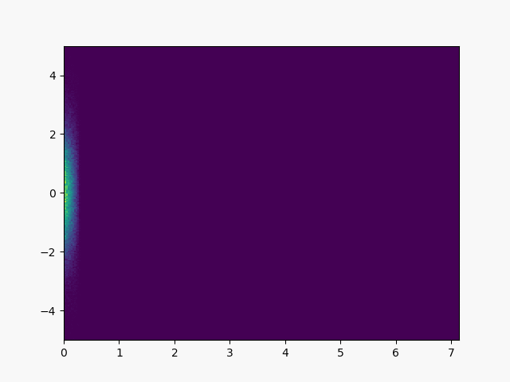
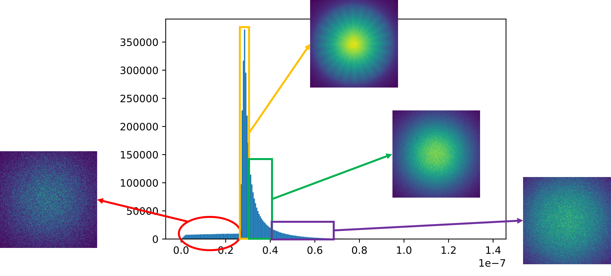
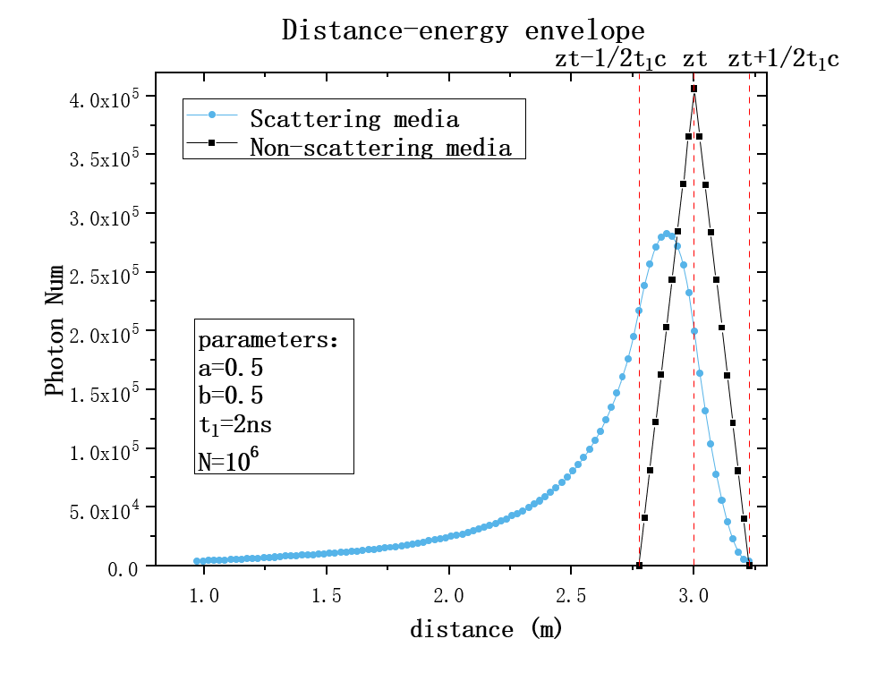

<h8 style="text-align: justify;">

<figure>
 
  <figcaption>
      <h10>图 1. 距离选通成像.</h10>
  </figcaption>
</figure>

水下光学成像技术已成为新型水下航行器的标准配置，广泛应用于资源调查、水下考古、海底管道检测、海洋生态研究、渔业资源评估、自主水下航行器（AUV）避障等领域。 与常规水下光学成像技术相比，距离选通成像的成像距离[图. 1]增加了2~3倍。 选通成像是一种利用脉冲可调的光源和门宽可调的探测器的成像技术。 由于选通探测器只接收一定时间内进入探测器的光，因此选通成像可以抑制环境噪声，获得高信噪比的目标图像。 由于脉冲激光与选通门的卷积效应，目标在不同距离处的回波信号强度形成三角形或梯形包络，可以反映目标的距离信息，因此距离选通成像可以获得 目标的三维信息。

然而，水体的后向散射效应在成像景深内仍然存在，导致图像信噪比（SNR）和对比度下降。 如何进一步降低或滤除水体后向散射噪声以提高图像对比度和成像距离已成为水下距离选通成像的研究热点。 基于蓝绿激光在水下的传输特性，采用蒙特卡罗方法模拟水下距离选通成像。 模拟了后向散射噪声分布与水的固有光学特性(IOP)参数之间的关系，为降低后向散射噪声提供了一种新途径。 仿真工作流程如图 2 所示。

<figure>
 
  <figcaption>
      <h10>图 2. 蒙特卡洛方法模拟成像过程的工作流程.</h10>
  </figcaption>
</figure>

为了探索散射介质中选通成像的规律，我们将建立一个蒙特卡洛主动成像仿真平台([MAISP](https://github.com/Msirte/MAISP))。 目前MAISP已具备初步功能，但仍需进一步完善，并结合实验数据。 我们模拟了光在散射介质中的传输过程，如图 3 所示。

<figure>
 
  <figcaption>
      <h10>图 3. 散射介质中的光传输.</h10>
  </figcaption>
</figure>

我们设计了一些初步的模拟实验并得到了一些有用的结果。 图 4 描述了选通成像回波信号在散射介质中的时间分布。 可以看出，目标回波信号并不是一次性出现，而是呈现出展宽效应。 根据光子被散射的程度，探测器接收到的光子分为弹道光子、蛇形光子和背向散射光子。 其中，弹道光子服从直线传播规律，携带的目标信息也最多； 蛇形光子携带部分目标信息，但由于介质的散射效应，其时空分布与弹道光子不同。 不同于直线传播规律的特点，会降低图像的对比度，产生模糊效果； 后向散射光子不携带目标信息，在目标图像中充当纯噪声成分。 从时间分布上看，目标回波脉冲前的光子为纯后向散射光子，目标回波脉冲以信号光子为主，目标回波脉冲后的短时间内，蛇形光子为主 . 随着时间的进一步增加，回波中的光子包括更多的后向散射光子和散射严重的蛇形光子。

<figure>
 
  <figcaption>
      <h10>图 4. 散射光的时空分布特征.</h10>
  </figcaption>
</figure>

仿真还在水下距离选通三维成像方面取得了新的结论。 例如，非散射环境下的三角形或梯形距离能量包络已不再适用，距离能量包络具有能量抑制、前向展宽和平滑的新特征[图。 5]. 这些新特性有助于改进3D成像算法，提高3D成像的距离分辨率和距离精度。

<figure>
 
  <figcaption>
      <h10>图 5. 散射介质中的距离-能量包络.</h10>
  </figcaption>
</figure>

这仍然是一个正在进行的项目，需要研究进一步的现象。 所有工作均在中国科学院半导体研究所王新伟研究员的指导下进行。

____________________________________________
参考资料：
[1]. A.A. Leino, A. Pulkkinen and T. Tarvainen, ValoMC: a Monte Carlo software and MATLAB toolbox for simulating light transport in biological tissue, OSA Continuum 2, 957-972 (2019).  
