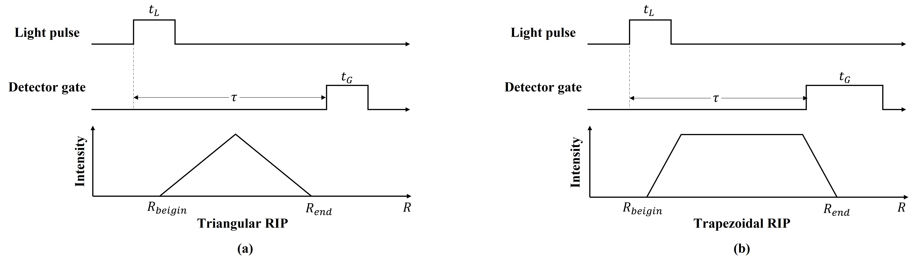
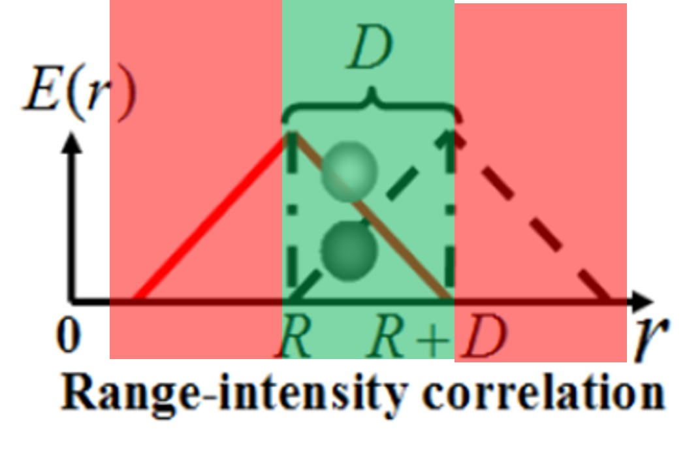
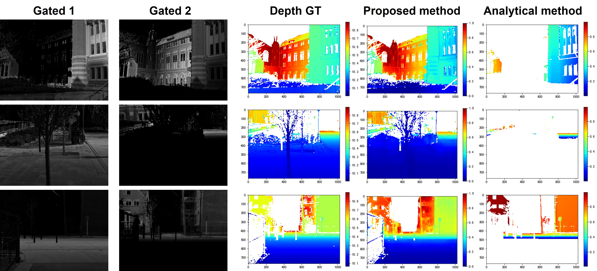

<h8 style="text-align: justify;">

<figure>
 
  <figcaption>
      <h10>Fig. 1. RIP曲线.</h10>
  </figcaption>
</figure>

在距离选通成像中，脉冲光源和选通相机通过延迟时间同步。 因此，接收图像中目标的强度与目标到探测器的距离有关。 距离-能量相关性由范围-能量包络 (RIP) 描述。 根据不同的光脉宽和选通门宽的不同，RIP 曲线可以是三角形或梯形，如图 1 所示。 目标的强度还与反射率有关。 因此，不可能从单个选通图像中恢复距离信息。 然而，使用两个（或多个）具有不同 RIP 的选通图像，可以通过使用 RIP 求解方程来恢复目标的距离。

<h8 style="text-align: justify;">

<figure>
 
  <figcaption>
      <h10>Fig. 2. 多个RIP曲线构成的重叠区和非重叠区.</h10>
  </figcaption>
</figure>

当目标位于 RIP 重叠区域（图 2 中以绿色显示）时，此方法有效。 在 RIP 的不重叠区域（图 2 中以红色显示），无法通过解析法恢复深度。 然而，由于场景深度和语义信息的连续性，部分深度信息仍然可以通过基于学习的方法恢复，如图3所示。

<h8 style="text-align: justify;">

<figure>
 
  <figcaption>
      <h10>Fig. 3. 从不重叠的RIP区间恢复深度信息.</h10>
  </figcaption>
</figure>

这仍然是一个正在进行的项目，需要研究进一步的现象。 所有工作均在中国科学院半导体研究所王新伟研究员的指导下进行。
