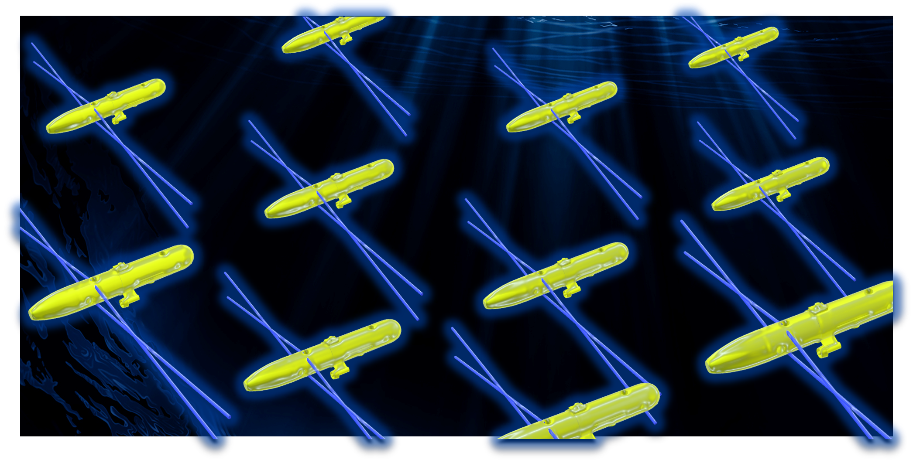
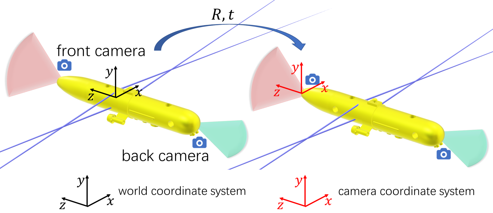
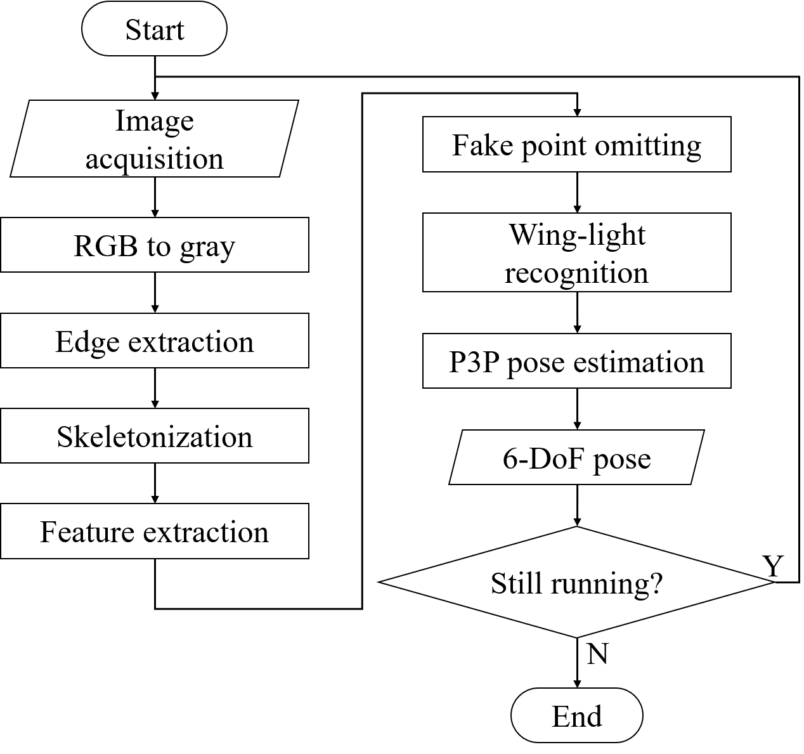
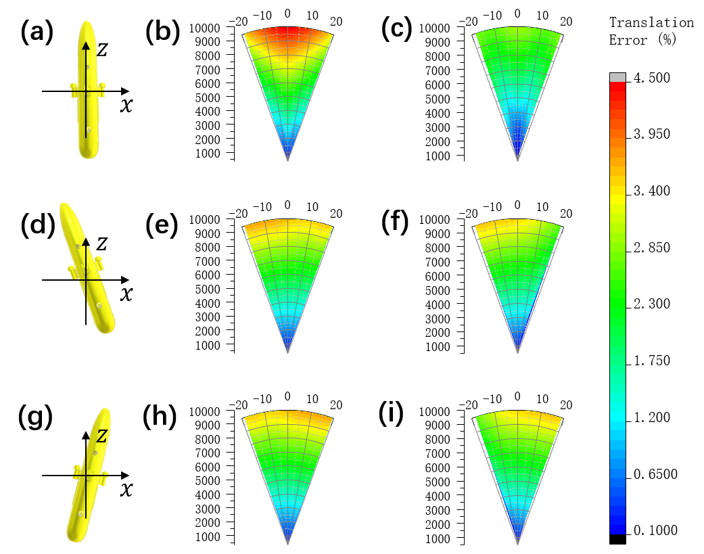
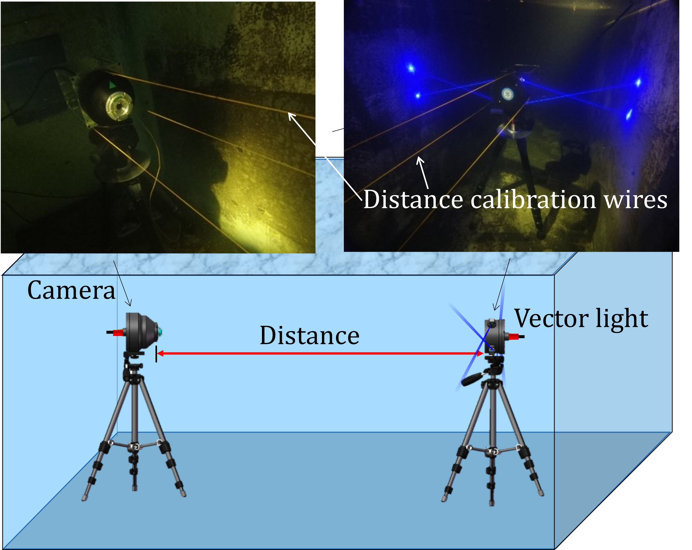

<h8 style="text-align: justify;">

<figure>
 
  <figcaption>
      <h10>图 1. 灵巧水下矢量光学视觉导引系统.</h10>
  </figcaption>
</figure>

我们提出了一种用于 AUV 对接和编队的灵巧水下矢量光学视觉导引 (VIOVG) 方法。 与使用 LED 阵列的传统光学视觉引导 (OVG) 方法不同，我们的方法使用由安装在 AUV 外壳上的四个激光二极管组成的灵巧水下矢量光学视觉导引系统。 由于水的散射作用和激光束的准直性，激光二极管可以发出明亮而细长的光束。 激光射线的交叉点形成翼灯，为位姿估计算法提供标记。 翼灯可以很容易地扩展到AUV的机械尺寸之外，从而提高位姿计算的精度。 我们进行了仿真和实验，表明 VIOVG 方法具有高精度和实用性，适用于 AUV 编队，特别是对于小型 AUV。

<figure>
 
  <figcaption>
      <h10>图 2. 配备矢量光导引系统、前后摄像头的AUV.</h10>
  </figcaption>
</figure>

在灵巧水下矢量光学视觉导引方法中，在执行AUV编队任务时，每台AUV都配备了灵巧水下矢量光学视觉导引系统，以及前置摄像头和后置摄像头，如图2所示。 AUV-A 上配备的系统被另一个 AUV-B 上的前置或后置摄像头捕获。 让世界坐标系定位在AUV-A上，相机坐标系定位在AUV-B的相机上。 由于灵巧水下矢量光学视觉导引系统的机械尺寸已知，AUV-B可以计算出世界坐标系到相机坐标系的相对旋转矩阵R和平移矢量t。 因此，可以解算 AUV-A 的相对 6-DoF 位姿。

<figure>
 
  <figcaption>
      <h10>图 3. 基于灵巧水下矢量光学视觉导引方法的位姿获取算法流程.</h10>
  </figcaption>
</figure>

姿态获取算法的工作流程如图3所示。 图像处理过程如视频1所示。之后，将图像中检测到的四个翼灯光点与世界坐标系中的四个翼灯光点一一对应。 最后，通过P3P位姿估计算法求解AUV的相对6-DoF位姿。

<figure>
<video src="optical-guiding.mp4" width="800px" height="600px" controls="controls"></video>
  <figcaption>
      <h10>视频 1. 图像处理过程.</h10>
  </figcaption>
</figure>

我们对两种情况下的姿态估计精度进行了仿真：（1）使用灵巧水下矢量光学视觉导引系统的AUV，（2）使用直接安装在外壁上的LED灯作为标记的AUV。 图 4 的仿真结果表明，在不同的相对偏航角下，与搭载 LED 阵列的 AUV 相比，配备灵巧水下矢量光学视觉导引系统的 AUV 的位姿估计更准确。

<figure>
 
  <figcaption>
      <h10>图 4. 搭载灵巧水下矢量光学视觉导引系统的AUV和搭载LED阵列作为标记的AUV在不同相对位姿下的位姿估计精度仿真结果。 (a)、(d)、(g) 偏航角为 0、-10 和 10 度的 AUV。 (b)、(e)、(h) 安装在 AUV 上的 LED 阵列在偏航角为 0、-10 和 10 度时的定位误差。 (c)、(f)、(i) 配备灵巧水下矢量光学视觉导引系统的 AUV 在偏航角为 0、-10 和 10 度时的定位误差。</h10>
  </figcaption>
</figure>

搭建了实验样机，如图 5 所示，将水下相机和矢量灯放置在水池中的两个三脚架上调整姿态。 距离标定线用于确定相机与矢量灯之间的距离，为定位实验提供地面真实距离值。 我们在 9.804 m 的距离上进行了位置估计。 计算距离R = 9.476 m，相对距离误差为3.35%。 实验结果表明，VIOVG系统在定位任务中具有良好的精度。 我们在 6 m 到 11 m 的不同距离和 0°、30° 和 60° 的偏航角上进行了实验。 矢量灯的图像如图6所示，从图中可以看出，在10 m以内的距离和不同的偏航角下，矢量灯图案清晰。 通过WetLabs AC-9吸收衰减仪测得实验水的衰减系数为0.15 m-1。 与传统OVG方法中使用的光点检测相比，线检测可以提供VIOVG图像中翼灯光点的亚像素位置，可以提高位姿求解的精度。

<figure>
 
  <figcaption>
      <h10>图 5. VIOVG 系统的实验设置。 水下相机和矢量灯放置在水池中的三脚架上。 距离校准线用于确定相机和矢量灯之间的距离.</h10>
  </figcaption>
</figure>

<figure>
 
  <figcaption>
      <h10>图 6. VIOVG 系统在不同距离和偏航角下的翼灯图案.</h10>
  </figcaption>
</figure>

所有工作均在中国科学院半导体研究所王新伟研究员的指导下进行。

相关论文：
* Zhang, Y., Wang, X., Lei, P., Wang, S., Yang, Y., Sun, L., & Zhou, Y. (2022). Smart vector-inspired optical vision guiding method for autonomous underwater vehicle docking and formation. Optics Letters, 47(11), 2919.

出于保密原因，无法提供代码。
____________________________________________
参考资料：
1. D. R. Blidberg, in IEEE ICRA (2001), 4, p. 1.
2. M. Carreras, J. D. Hernandez, E. Vidal, N. Palomeras, D. Ribas, and P. Ridao, IEEE J. Oceanic Eng. 43, 344–355 (2018).
3. M. P. Brito, R. S. Lewis, N. Bose, and G. Griffiths, IEEE Trans. Eng. Manage. 66, 98–111 (2019).
4. Martins, Almeida, and Silva, in Oceans 2003. Celebrating the Past ... Teaming Toward the Future (IEEE Cat. No.03CH37492) (IEEE, 2003), pp. 347-352 Vol.1.
5. G. You, Y. Pang, and D. Jiang, J Mar. Sc. Appl. 4, 7–12 (2005).
6. M. F. Fallon, G. Papadopoulos, and J. J. Leonard, in 2010 IEEE International Conference on Robotics and Automation (IEEE, 2010), pp. 4256–4263.
7. J. E. Manley, in 2004 IEEE/OES Autonomous Underwater Vehicles (IEEE Cat. No.04CH37578) (IEEE, 2004), pp. 20–25.
8. P. Baccou, B. Jouvencel, V. Creuze, and C. Rabaud, in MTS/IEEE Oceans 2001. An Ocean Odyssey. Conference Proceedings (IEEE Cat. No.01CH37295) (Marine Technol. Soc, 2001), 3, pp. 1816–1821.
9. Gao Rui and M. Chitre, in OCEANS’10 IEEE SYDNEY (IEEE, 2010), pp. 1–6.
10. K. G. Kebkal and A. I. Mashoshin, Gyroscopy Navig. 8, 80–89 (2017).
11. A. B. Figueiredo, B. M. Ferreira, and A. C. Matos, in OCEANS 2016 - Shanghai (IEEE, 2016), pp. 1–7.
12. K. N. Lwin, N. Mukada, M. Myint, D. Yamada, M. Minami, T. Matsuno, K. Saitou, and W. Godou, Artif Life Robotics 23, 409–419 (2018).
13. Y. Hamamatsu, T. Matsuda, T. Sakamaki, and T. Maki, in OCEANS 2019 - Marseille (IEEE, 2019), pp. 1–5.
14. R. Pérez-Alcocer, L. A. Torres-Méndez, E. Olguín-Díaz, and A. A. Maldonado-Ramírez, Journal of Sensors 2016, 1–16 (2016).
15. J.-Y. Park, B. Jun, P. Lee, and J. Oh, Ocean Engineering 36, 48–61 (2009).
16. Y. Li, Y. Jiang, J. Cao, B. Wang, and Y. Li, Ocean Engineering 110, 163–173 (2015).
17. Xiao-Shan Gao, Xiao-Rong Hou, Jianliang Tang, and Hang-Fei Cheng, IEEE Trans. Pattern Anal. Machine Intell. 25, 930–943 (2003).
18. R. O. Duda and P. E. Hart, Commun. ACM 15, 11–15 (1972).